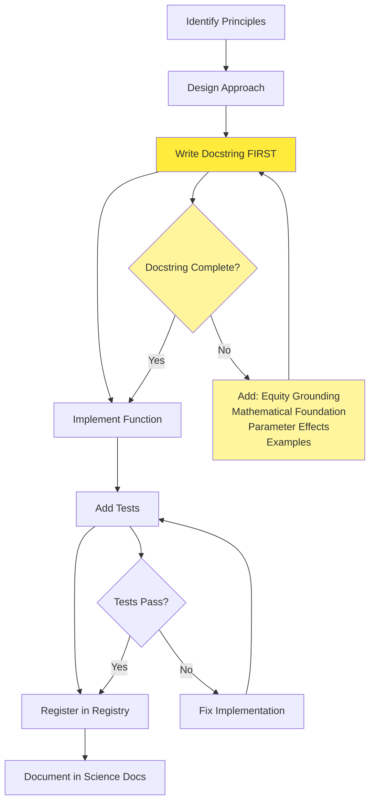

# Adding Allocation Approaches

This guide explains how to add new allocation approaches to fair-shares.

---

## Overview

Allocation approaches live in two directories:

| Type    | Location                | Output                          |
| ------- | ----------------------- | ------------------------------- |
| Budget  | `allocations/budgets/`  | Single cumulative allocation    |
| Pathway | `allocations/pathways/` | Time-varying annual allocations |

Each approach is registered in `allocations/registry.py`.

**Essential Resources:**

- [Docstring Template]({DOCS_ROOT}/dev-guide/docstring-template/) - Required structure for all allocation approach docstrings
- [Testing Checklist]({DOCS_ROOT}/dev-guide/testing-checklist/) - Pre-merge validation checklist for new approaches

---

## Before You Begin: The Principles-First Requirement

Every allocation approach in fair-shares operationalizes specific equity principles. Before writing code, you must be able to answer:

1. **What equity principle(s) does this approach implement?**
   (e.g., equal rights to atmosphere, CBDR-RC, capability, subsistence protection)

2. **What value judgments are embedded in the approach?**
   (e.g., start date for historical responsibility, income thresholds)

3. **How does it relate to existing approaches?**
   (Is it a variant? A new principle? A combination?)

If you cannot answer these questions, read [Principle-to-Code Workflow]({DOCS_ROOT}/science/principle-to-code/) before proceeding.

!!! warning "Why Equity Grounding Matters"

    **This is not optional.** Allocation approaches without clear principled foundations cannot be properly documented, tested, or explained to users.

    Climate equity is inherently normative — every allocation approach embeds value judgments about fairness, responsibility, and capability. Without explicit grounding in equity principles:

    - **Users cannot make informed choices** — They need to understand what values each approach represents
    - **Documentation becomes incomplete** — The [Docstring Template]({DOCS_ROOT}/dev-guide/docstring-template/) requires citing academic sources and explaining normative choices
    - **Testing becomes arbitrary** — How do you validate behavior without knowing what the approach *should* do?
    - **Maintenance becomes impossible** — Future contributors cannot understand intent or make principled modifications

    The fair-shares project exists to operationalize climate equity principles transparently. Approaches that hide their value judgments undermine this core mission.

---

## Contribution Workflow

Follow this workflow when adding a new allocation approach:



**Key principles:**

1. **Docstring before implementation** - Writing the docstring first forces you to clarify the equity grounding, mathematical foundation, and parameter effects before coding
2. **Tests validate behavior** - Tests should verify both correctness and that parameters have expected effects
3. **Registration makes it discoverable** - Until registered, the approach cannot be used via the high-level API

---

## Step 1: Understand the Pattern

### Function Signature

All allocation functions follow a consistent pattern:

```python
def my_new_budget(
    # Required data
    population_ts: TimeseriesDataFrame,
    allocation_year: int,
    emission_category: str,
    # Optional data (for adjustments)
    country_actual_emissions_ts: TimeseriesDataFrame | None = None,
    gdp_ts: TimeseriesDataFrame | None = None,
    # Parameters specific to this approach
    my_parameter: float = 0.5,
    # Common parameters
    group_level: str = "iso3c",
    unit_level: str = "unit",
) -> BudgetAllocationResult:
    """Docstring with academic context."""
    ...
```

### Required Return Type

- Budget approaches: `BudgetAllocationResult`
- Pathway approaches: `PathwayAllocationResult`

Both are dataclasses in `allocations/results/`.

---

## Step 2: Implement the Function

### Budget Example

Create a new file or add to existing module in `allocations/budgets/`:

```python
"""My new allocation approach."""

from fair_shares.library.allocations.results import BudgetAllocationResult
from fair_shares.library.validation.models import AllocationInputs, AllocationOutputs


def my_new_budget(
    population_ts,
    allocation_year: int,
    emission_category: str,
    my_parameter: float = 0.5,
    group_level: str = "iso3c",
    unit_level: str = "unit",
) -> BudgetAllocationResult:
    """
    Allocate budget using my new approach.

    This approach does X based on principle Y from Author (Year).

    Parameters
    ----------
    population_ts : TimeseriesDataFrame
        Population data with MultiIndex (iso3c, unit)
    allocation_year : int
        Year when allocation begins
    emission_category : str
        Emission category being allocated
    my_parameter : float, default 0.5
        Controls strength of adjustment

    Returns
    -------
    BudgetAllocationResult
        Contains relative_shares_cumulative_emission

    See Also
    --------
    docs/science/allocations.md : Theoretical grounding
    """
    # Validate inputs
    AllocationInputs(
        population_ts=population_ts,
        first_allocation_year=allocation_year,
        last_allocation_year=allocation_year,
    )

    # Calculate shares (must sum to 1)
    # ... your implementation ...

    relative_shares = calculate_shares(population_ts, allocation_year, my_parameter)

    # Validate outputs
    AllocationOutputs(relative_shares=relative_shares)

    # Return result
    return BudgetAllocationResult(
        approach="my-new-budget",
        emission_category=emission_category,
        relative_shares_cumulative_emission=relative_shares,
        parameters={
            "allocation_year": allocation_year,
            "my_parameter": my_parameter,
        },
    )
```

### Key Implementation Details

1. **Validate inputs** using `AllocationInputs` Pydantic model
2. **Shares must sum to 1** for each group (e.g., climate-assessment, quantile)
3. **Validate outputs** using `AllocationOutputs` model
4. **Document thoroughly** with academic citations (see [Docstring Template]({DOCS_ROOT}/dev-guide/docstring-template/) for required structure)

---

## Step 3: Export the Function

Add to the module's `__init__.py`:

```python
# allocations/budgets/__init__.py
from fair_shares.library.allocations.budgets.my_module import my_new_budget

__all__ = [
    "equal_per_capita_budget",
    "per_capita_adjusted_budget",
    "per_capita_adjusted_gini_budget",
    "my_new_budget",  # Add here
]
```

---

## Step 4: Register the Approach

Add to `allocations/registry.py`:

```python
from fair_shares.library.allocations.budgets import (
    # ... existing imports ...
    my_new_budget,
)

def get_allocation_functions() -> dict[str, Callable[..., Any]]:
    return {
        # ... existing approaches ...
        "my-new-budget": my_new_budget,
    }
```

---

## Step 5: Add Tests

Create tests in `tests/test_allocations/`:

```python
from fair_shares.library.utils import create_example_data


def test_my_new_budget_basic():
    """Test basic functionality."""
    data = create_example_data()
    result = my_new_budget(
        population_ts=data["population"],
        allocation_year=2020,
        emission_category="co2-ffi",
    )

    # Shares sum to 1
    shares = result.relative_shares_cumulative_emission["2020"]
    assert abs(shares.sum() - 1.0) < 1e-10

    # Result type
    assert result.approach == "my-new-budget"


def test_my_new_budget_parameter_effect():
    """Test that parameter has expected effect."""
    data = create_example_data()
    result_low = my_new_budget(
        population_ts=data["population"],
        allocation_year=2020,
        emission_category="co2-ffi",
        my_parameter=0.0,
    )
    result_high = my_new_budget(
        population_ts=data["population"],
        allocation_year=2020,
        emission_category="co2-ffi",
        my_parameter=1.0,
    )

    # Verify parameter affects results as expected
    assert result_low.approach == "my-new-budget"
    assert result_high.approach == "my-new-budget"
```

**Before merging**, complete all validation steps in the [Testing Checklist]({DOCS_ROOT}/dev-guide/testing-checklist/).

---

## Step 6: Document

1. **Docstring** - Follow the comprehensive structure in [Docstring Template]({DOCS_ROOT}/dev-guide/docstring-template/)
   - Include Mathematical Foundation with LaTeX equations
   - Document all parameters with cross-references to parameter-effects.md
   - Add Notes section with theoretical grounding and normative choices
   - Provide working Examples using `create_example_data()`
2. **Science docs** - Add to `docs/science/allocations.md` if introducing new principle
3. **API docs** - Will auto-generate from docstrings via mkdocstrings

---

## Existing Implementations as Examples

| Approach                            | File                                            | Good Example Of            |
| ----------------------------------- | ----------------------------------------------- | -------------------------- |
| `equal_per_capita_budget`           | `budgets/per_capita.py`                         | Simple budget allocation   |
| `per_capita_adjusted_budget`        | `budgets/per_capita.py`                         | Multiple adjustments       |
| `cumulative_per_capita_convergence` | `pathways/cumulative_per_capita_convergence.py` | Complex pathway allocation |

---

## Common Utilities

| Utility                           | Purpose                                       |
| --------------------------------- | --------------------------------------------- |
| `filter_time_columns()`           | Extract year columns from DataFrame           |
| `calculate_relative_adjustment()` | Compute responsibility/capability adjustments |
| `apply_deviation_constraint()`    | Limit extreme allocations                     |
| `validate_weight_constraints()`   | Check weights sum correctly                   |

See [Utils API]({DOCS_ROOT}/api/utils/core/) for full documentation.
