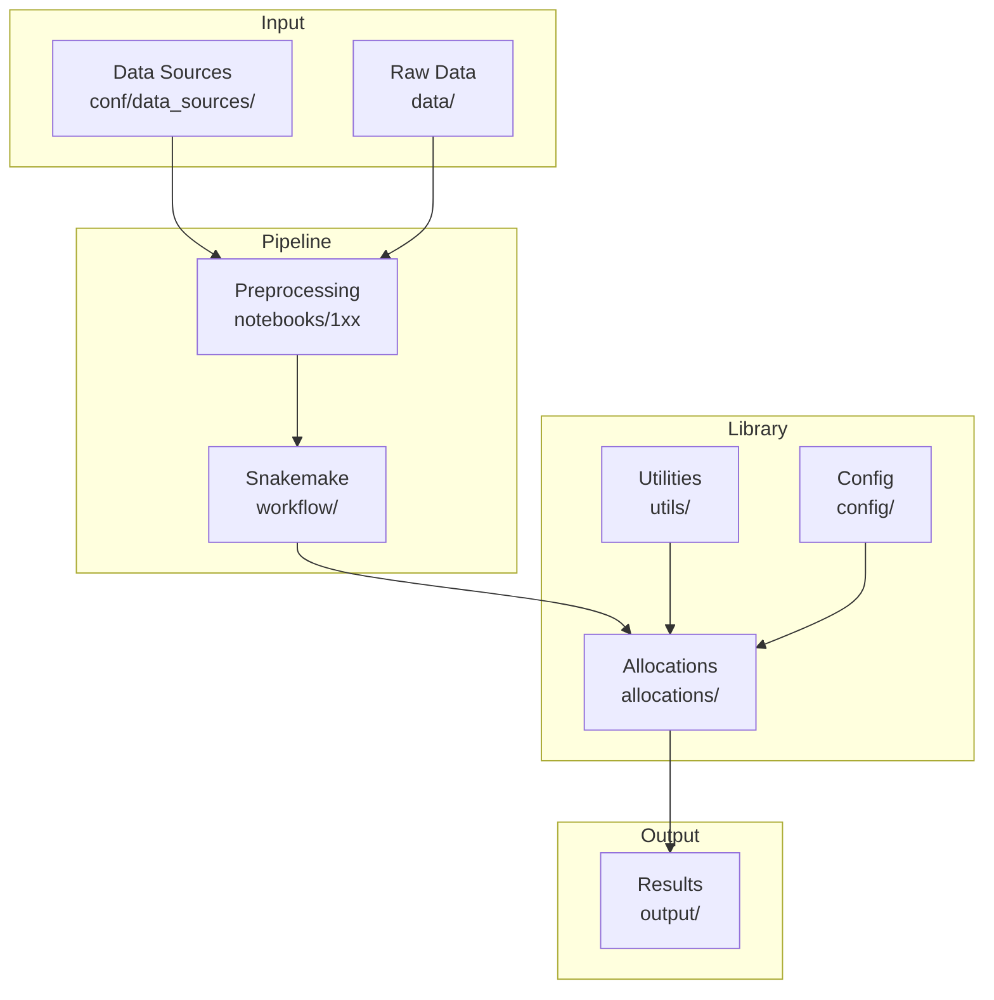

# Developer Guide

This guide explains the fair-shares architecture and how to extend the library.

---

## Architecture Overview



---

## Key Modules

| Module            | Location                               | Responsibility                 |
| ----------------- | -------------------------------------- | ------------------------------ |
| **Allocations**   | `src/fair_shares/library/allocations/` | Core allocation functions      |
| **Utilities**     | `src/fair_shares/library/utils/`       | Data manipulation, adjustments |
| **Config**        | `src/fair_shares/library/config/`      | Pydantic models                |
| **Preprocessing** | `notebooks/1xx_*.py`                   | Data pipeline notebooks        |

---

## Allocations Module

### Structure

```
allocations/
├── __init__.py
├── budgets/
│   ├── __init__.py
│   └── per_capita.py      # Budget allocation functions
├── pathways/
│   ├── __init__.py
│   ├── per_capita.py      # Pathway allocation functions
│   ├── per_capita_convergence.py
│   └── cumulative_per_capita_convergence.py
├── results/               # Result dataclasses
├── core.py               # Shared logic
├── manager.py            # AllocationManager
└── registry.py           # Approach name → function mapping
```

### Entry Points

**Direct function calls:**

```python
from fair_shares.library.allocations.budgets import equal_per_capita_budget

result = equal_per_capita_budget(
    population_ts=population_df,
    allocation_year=2020,
    emission_category="co2-ffi",
)
```

**AllocationManager (high-level):**

```python
from fair_shares.library.allocations import AllocationManager

manager = AllocationManager()
results = manager.run_parameter_grid(
    allocations_config=config,
    population_ts=population_df,
    # ...
)
```

### Result Types

| Type                      | Module                | Description                     |
| ------------------------- | --------------------- | ------------------------------- |
| `BudgetAllocationResult`  | `allocations.results` | Single cumulative allocation    |
| `PathwayAllocationResult` | `allocations.results` | Time-varying annual allocations |

`BudgetAllocationResult` contains `relative_shares_cumulative_emission`; `PathwayAllocationResult` contains `relative_shares_pathway_emissions`. Both sum to 1.0 and provide methods to compute absolute emissions.

---

## Adding New Functionality

- **[Adding Allocation Approaches](https://setupelz.github.io/fair-shares/dev-guide/adding-approaches/)** - New equity principles
- **[Adding Data Sources](https://setupelz.github.io/fair-shares/dev-guide/adding-data-sources/)** - New datasets

---

## Conventions

### Year Columns as Strings

**Critical:** Year columns must be strings, not integers.

```python
# Correct
df["2020"]

# Incorrect
df[2020]
```

Always call `ensure_string_year_columns(df)` after loading data.

### Kebab vs Snake Case

| Context               | Style      | Example                   |
| --------------------- | ---------- | ------------------------- |
| Config/approach names | kebab-case | `equal-per-capita-budget` |
| Python identifiers    | snake_case | `equal_per_capita_budget` |

### Index Structure

DataFrames use MultiIndex with standard levels:

| Data Type      | Index Levels                         |
| -------------- | ------------------------------------ |
| Emissions      | `iso3c`, `unit`, `emission-category` |
| GDP/Population | `iso3c`, `unit`                      |
| Gini           | `iso3c`, `unit`                      |

---

## Testing

```bash
# Run all tests
uv run pytest tests/

# Run specific test module
uv run pytest tests/unit/allocations/

# Run with coverage
uv run pytest --cov=fair_shares tests/
```

---

## Code Quality

```bash
# Lint
uv run ruff check src/ tests/

# Format
uv run ruff format src/ tests/
```

---

## Documentation Workflow

### Checking Documentation Consistency

Use `tools/docs-sync-check.py` to validate documentation is in sync with code:

```bash
# Run all validation checks
uv run python tools/docs-sync-check.py

# Suppress warnings (only show errors)
uv run python tools/docs-sync-check.py --quiet

# Show progress for each check
uv run python tools/docs-sync-check.py --verbose
```

**What it checks:**

| Check                     | Purpose                                                           |
| ------------------------- | ----------------------------------------------------------------- |
| **Registry coverage**     | All approaches in `registry.py` have API docs and catalog entries |
| **Example syntax**        | Python code blocks in docs parse without syntax errors            |
| **Parameter consistency** | Parameters in code match those documented in `allocations.md`     |
| **Cross-references**      | Internal markdown links resolve to existing files and anchors     |

**Exit codes:**

- `0` - No errors (warnings may be present)
- `1` - One or more errors found
- `2` - Invalid command-line arguments

**Best practices:**

- Run before committing documentation changes
- Address errors immediately (broken links, invalid syntax)
- Review warnings to identify documentation gaps

**False positives:** The script automatically skips:

- Documentation examples with GOOD/BAD or CORRECT/WRONG markers (intentionally incomplete)
- Docstring section examples (showing docstring structure)
- DataFrame representations and tabular data
- Code blocks with ellipsis (`...`) or `TODO` comments

---

## See Also

- **[API Reference](https://setupelz.github.io/fair-shares/api/)** - Function documentation
- **[Scientific Documentation](https://setupelz.github.io/fair-shares/science/allocations/)** - Theoretical foundations
