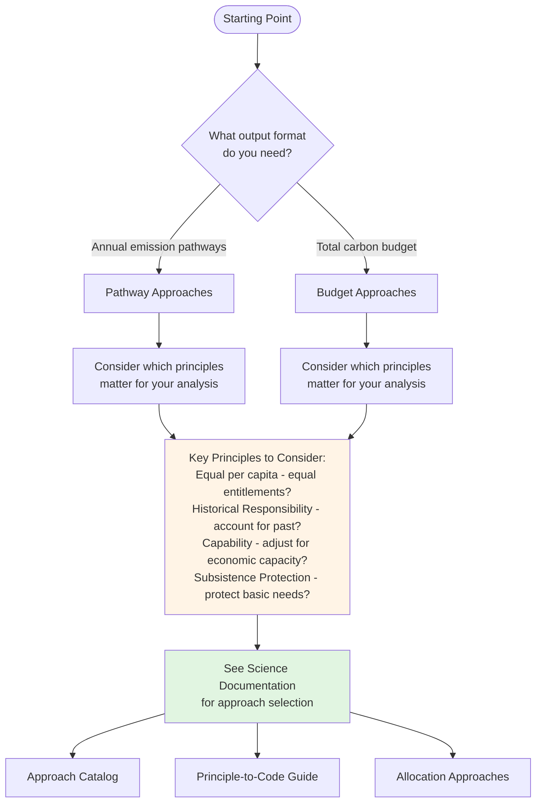

# User Guide

<!-- REFERENCE: Workflows are entry points to different allocation pipelines
     country-fair-shares: Implemented via manager in src/fair_shares/library/allocations/manager.py
     iamc-regional-fair-shares: Uses direct function calls from src/fair_shares/library/utils/data/iamc.py
-->

## Workflows

| Workflow                                                      | Notebook                                 | Description                             |
| ------------------------------------------------------------- | ---------------------------------------- | --------------------------------------- |
| **[country-fair-shares]({DOCS_ROOT}/user-guide/country-fair-shares/)**             | `301_custom_fair_share_allocation.ipynb` | Country-level allocations with pipeline |
| **[iamc-regional-fair-shares]({DOCS_ROOT}/user-guide/iamc-regional-fair-shares/)** | `401_iamc_fair_share_allocation.ipynb`   | IAMC model region allocations           |

Both workflows produce relative shares (0-1) and absolute emissions (Mt CO2e).

---

## Outputs

| Output Type        | Description                                   | Format       |
| ------------------ | --------------------------------------------- | ------------ |
| Relative shares    | Country fractions summing to 1.0              | Parquet, CSV |
| Absolute emissions | Shares × global target in physical units      | Parquet, CSV |
| Comparison tables  | Results across multiple approaches/parameters | CSV (wide)   |

---

## Configuration

Data sources are configured in `conf/data_sources/`. Available options:

| Data Type  | Options                                            |
| ---------- | -------------------------------------------------- |
| Target     | `rcbs` (budgets), `ar6` (pathways), `rcb-pathways` |
| Emissions  | PRIMAP-hist versions                               |
| Population | UN/OWID                                            |
| GDP        | World Bank WDI                                     |
| Gini       | UNU-WIDER                                          |

### RCB Pathway Generation

The `rcb-pathways` target converts the global remaining carbon budget (RCB) into an annual emission pathway, which is then allocated among countries using pathway allocation approaches.

**How it works:**

1. The global remaining carbon budget (RCB) is converted to an annual emission pathway using normalized shifted exponential decay
2. Pathway allocation approaches distribute the global pathway among countries (e.g., `equal-per-capita`)
3. The pathway starts at historical emissions, reaches zero by the end year, and the discrete sum equals the carbon budget

This is useful when you need pathway outputs for comparison with scenarios, starting from a global carbon budget constraint.

**Configuration:** Set `target: "rcb-pathways"` in your data source config. The generator defaults to `exponential-decay`.

**See also:** [Other Operations: RCB Pathway Generation]({DOCS_ROOT}/science/other-operations/#rcb-pathway-generation)

---

## Which Approach Should I Choose?

Start by clarifying your analytical needs and ethical priorities:

**Understanding Your Needs:**

1. **Output format:** Do you need year-by-year emission pathways or a single total carbon budget?
2. **Principles:** Which principles are most relevant to your analysis?

**Next Steps:**

Once you understand your needs and priorities, consult the science documentation to select an appropriate approach:

- **[Approach Catalog]({DOCS_ROOT}/user-guide/approach-catalog/)** — Browse all available approaches with brief descriptions
- **[Principle-to-Code Guide]({DOCS_ROOT}/science/principle-to-code/)** — Learn how ethical principles translate to implementation choices
- **[Allocation Approaches]({DOCS_ROOT}/science/allocations/)** — Understand the design and parameters of each approach

The science documentation will help you understand how different approaches operationalize these principles, allowing you to make an informed choice based on your analytical goals.

---

## See Also

- **[Allocation Approaches]({DOCS_ROOT}/science/allocations/)** — Design and parameters
- **[Climate Equity Concepts]({DOCS_ROOT}/science/climate-equity-concepts/)** — Theoretical foundations
- **[API Reference]({DOCS_ROOT}/api/index/)** — Function documentation
